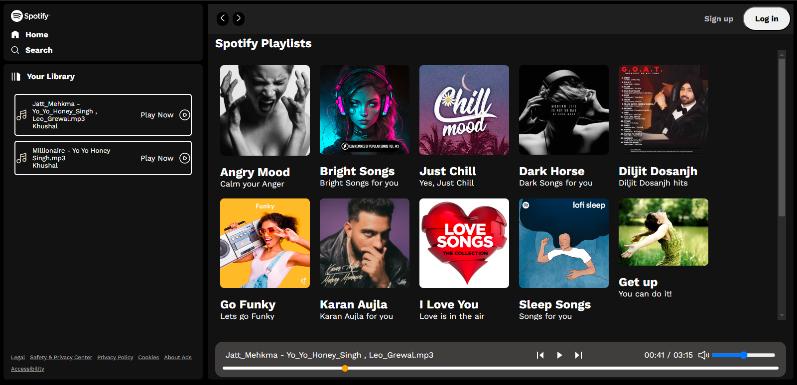
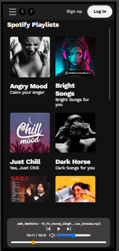
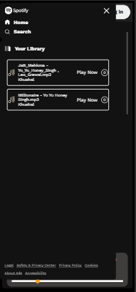

# Spotify Clone


A fully responsive Spotify web application clone that mimics the look and feel of the original Spotify website. Created using **HTML**, **CSS**, and **JavaScript** to demonstrate front-end development skills.

## 🌟 Features

- **Responsive Design:** Fully functional across devices (desktop, tablet, mobile).
- **Dynamic UI:** Interactive and visually appealing interface.
- **Custom Playlists and Songs UI:** UI elements for playlists, albums, and song previews.
- **Smooth Animations:** Transitions and hover effects for a modern look.

## 📂 Project Structure

```
spotify-clone/
├── index.html          # Main HTML file
├── css/
│   ├── style.css       # Core styles for the website
├── js/
│   ├── app.js          # JavaScript for interactions
├── assets/
│   ├── images/         # All images used in the project
│   ├── icons/          # Icon assets
├── README.md           # Project documentation
```

## 🛠️ Technologies Used

- **HTML5** - Structure of the website.
- **CSS3** - Styling, animations, and responsive design.
- **JavaScript (Vanilla)** - Adding interactivity to the project.

## 📸 Screenshots

### Desktop View



### Mobile View




## ⚙️ Installation

1. Clone the repository:

   ```bash
   git clone https://github.com/KhushalPatel18/spotify-clone.git
   ```

2. Navigate to the project folder:

   ```bash
   cd spotify-clone
   ```

3. Open `index.html` in your browser to view the project:

   ```
   open index.html
   ```

## 🌱 Future Enhancements

- Add music playback functionality.
- Implement a backend for user authentication and playlist management.
- Enhance animations for a better user experience.

## 💡 Inspiration

This project is inspired by Spotify's web app to enhance front-end development skills and replicate real-world designs.

## 🙌 Contribution

Contributions are welcome! If you'd like to contribute, follow these steps:

1. Fork the repository.
2. Create a new branch:
   ```bash
   git checkout -b feature-name
   ```
3. Make your changes and commit:
   ```bash
   git commit -m 'Add some feature'
   ```
4. Push the changes:
   ```bash
   git push origin feature-name
   ```
5. Submit a pull request.

---

Feel free to star ⭐ this repository if you found it useful!

